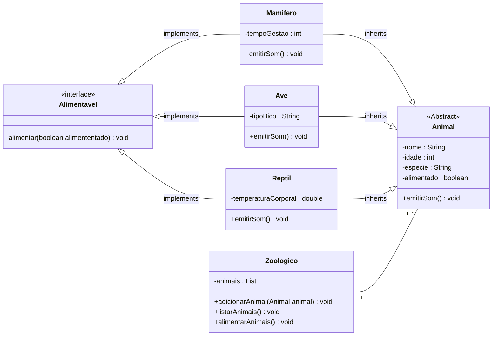

## Atividade 1

O exercício consiste em criar um sistema de gerenciamento de animais em um zoológico. O sistema deve ser capaz de cadastrar novos animais, listar os animais existentes no zoológico e alimentar os animais. 

:white_check_mark: [Para isso, você deve criar uma classe abstrata Animal, que terá os seguintes atributos privados: nome: nome do animal (`String`) idade: idade do animal (`int`) `especie`: espécie do animal (`String`) alimentado: booleano que indica se o animal foi alimentado recentemente (`true ou false`) Além disso, a classe Animal deve ter um método abstrato chamado `emitirSom()`, que será implementado nas classes filhas.](Animal.java)

As classes filhas de Animal serão: 

:white_check_mark: [Mamifero: terá um atributo privado `tempoGestacao (int)` e implementará o método `emitirSom()` com um som característico dos mamíferos.](Mamifero.java)
:white_check_mark: [Ave: terá um atributo privado `tipoBico (String)` e implementará o método `emitirSom()` com um som característico das aves.](Ave.java)
:white_check_mark: [Reptil: terá um atributo privado `temperaturaCorporal (double)` e implementará o método `emitirSom()` com um som característico dos répteis.](Reptil.java)

:white_check_mark: [Cada classe filha deve ter um construtor que inicialize os atributos da classe e também chame o construtor da classe pai (Animal).](Reptil.java#L8)

:white_check_mark: [Agora, você deve criar uma interface chamada `Alimentavel`, que terá um método público chamado alimentar(). Essa interface será implementada por todas as classes filhas de Animal. )](Alimentavel.java)

:white_check_mark: [Por fim, você deve criar uma classe `Zoologico`, que terá uma lista privada de animais `(List animais)`. Essa classe terá os seguintes métodos públicos: `adicionarAnimal(Animal animal):` adiciona um animal à lista de animais do zoológico. `listarAnimais():` lista todos os animais presentes no zoológico. `alimentarAnimais():` alimenta todos os animais presentes no zoológico, chamando o método alimentar() de cada animal.](Zoologico.java)

Você deve testar o sistema criando objetos das classes filhas de Animal e adicionando-os ao zoológico, além de alimentar os animais e listar todos os animais presentes no zoológico.

