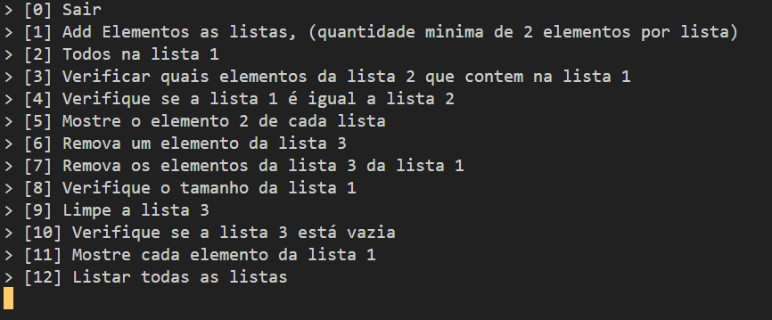

### TO-DO

:white_check_mark: Faça três listas usando Collections (2 ArrayList e 1 LinkedList), faça uma função, que recebe a lista e uma String, que adiciona a String a lista. 

:white_check_mark: Faça o usuário adicionar 2 valores em cada lista (Valide se o texto digitado pelo usuário contém um número e crie uma exceção personalizada de Exception para tratar esse erro).

:white_check_mark: Adicione todos os elementos da lista 2 e 3 para a lista 1.

:white_check_mark: Verifique se um elemento da lista 2 contém na lista 1.

:white_check_mark: Verifique se todos os elementos da lista 3 estão na lista 1.

:white_check_mark: Verifique se a lista 1 é igual a lista 2.

:white_check_mark: Mostre o elemento 2 de cada lista.

:white_check_mark: Remova um elemento da lista 3.

:white_check_mark: Remova os elementos da lista 3 da lista 1.

:white_check_mark: Verifique o tamanho da lista 1.

:white_check_mark: Limpe a lista 3.

:white_check_mark: Verifique se a lista 3 está vazia.

:white_check_mark: Mostre cada elemento da lista 1.

#### Adicional

:white_check_mark: Listar elementos de todas as listas.  