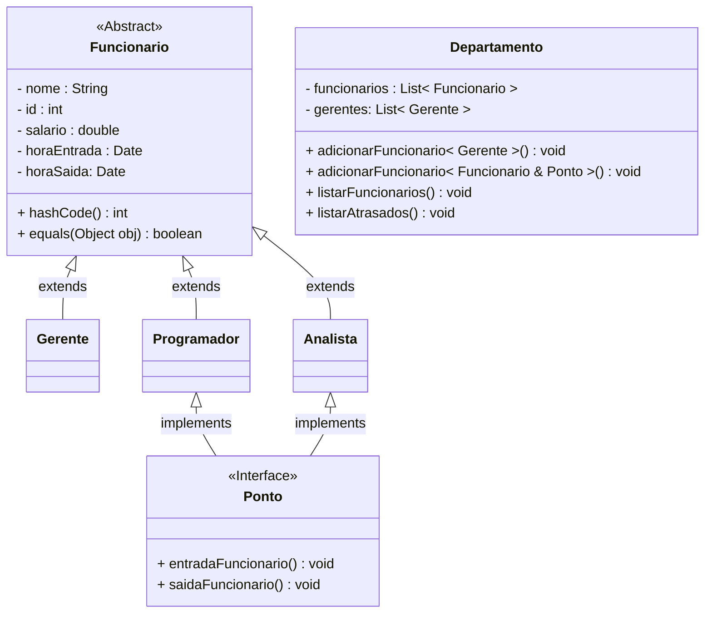
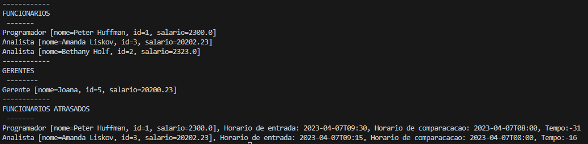

<h1 align=center> Atividade 4 </h1>

Suponha que você esteja criando um sistema de gerenciamento de funcionários de uma
empresa organizados em departamentos. 

:white_check_mark: [Cada funcionário tem um nome, um ID, um salário, hora de entrada e hora de saída.](Funcionario/Funcionario.java) 


Sua tarefa é criar uma classe Departamento que permita adicionar e listar funcionários.

:white_check_mark: Para isso, crie uma classe [`Funcionario`](Funcionario/Funcionario.java) que represente um funcionário da empresa. Crie três classes que herdam de funcionários: [Gerente](Funcionario/Gerente.java), [Programador](Funcionario/Programador.java) e [Analista](Funcionario/Analista.java).

:white_check_mark: Crie um interface que define os métodos entrada e saída que recebam a hora de entrada e saída do funcionário, 

:white_check_mark: implemente essa interface para as classes Programador e Analista, mas não para Gerente, fazendo a atribuição da hora de entrada e hora de saída ao funcionário.

:white_check_mark: Além disso, você deve implementar o método `equals` na classe `Funcionario` para que ele compare dois funcionários com base em seus IDs. Para isso, você pode usar a classe `Object`, já que todos os objetos em Java herdam dela.


:white_check_mark: Em seguida, crie uma classe Departamento que use `Generics` para permitir que ela manipule um lista de qualquer tipo de Funcionário que implemente Ponto e outra lista que permita apenas gerente. 

:white_check_mark: A classe Departamento deve ter um método `adicionarFuncionario` que aceite um objeto do tipo `Funcionario` e um do tipo Gerente

  ```java
  //eureka man
    public static <T extends Funcionario & Ponto> void adicionaFuncionario(T funcionario){
                funcionarios.add(funcionario);
    }
    public static < T extends Gerente> void adicionaFuncionario(T funcionario){
            gerentes.add(funcionario);
    }
  ```

:white_check_mark: Um método `listarFuncionarios` que retorne uma lista de objetos do tipo `Funcionario` 

:white_check_mark: Um método `listarAtrasados` que retorne uma lista de objetos que tem hora de entrada maior que uma especificada.

:white_check_mark: Por fim, crie algumas classes concretas que estendem `Funcionario`, como Gerente, Programador e Analista.

:white_check_mark: Crie alguns objetos dessas classes e adicione-os à lista da empresa. 

:white_check_mark: Em seguida, liste os funcionários para verificar se a empresa está armazenando e manipulando corretamente os diferentes tipos de funcionários 

:white_check_mark: Adicione entradas no Ponto e liste os atrasados.

Dica: Para usar `Generics`, utilize <T> na declaração da classe Departamento, e use
List<T> para permitir que a empresa possa manipular qualquer tipo de funcionário.




OUTPUT:

